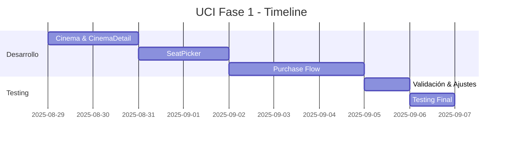

# UCI Cinemas - Fase 1: Automatización Smoke Tests

## 📋 Resumen Ejecutivo

**Objetivo**: Implementar automatización básica de smoke tests para UCI Cinemas basándose en la estructura existente de Cinesa.

**Duración Estimada**: 6-9 días de desarrollo

**Prioridad**: Crítica

**Estado Actual**: En Planificación

---

## 🎯 Objetivos de la Fase 1

### Objetivos Principales

- ✅ Implementar flujo completo de compra básico (smoke test)
- ✅ Crear Page Objects fundamentales para UCI
- ✅ Validar funcionalidad crítica del sitio web
- ✅ Establecer base para automatización completa (Fase 2)

### Objetivos Secundarios

- 📊 Detectar regresiones críticas en despliegues
- 🚀 Mejorar confianza en releases
- 📈 Reducir tiempo de testing manual

---

## 🔍 Análisis de Estado Actual

### ✅ UCI - Implementado

| Componente   | Estado      | Funcionalidad                   |
| ------------ | ----------- | ------------------------------- |
| Navbar       | ✅ Completo | Navegación básica               |
| CookieBanner | ✅ Completo | Aceptación de cookies           |
| PromoModal   | ✅ Completo | Manejo de modales promocionales |

### ❌ UCI - Faltante (Crítico)

| Componente      | Prioridad | Descripción                       |
| --------------- | --------- | --------------------------------- |
| Cinema          | 🔴 Alta   | Selección de cines                |
| CinemaDetail    | 🔴 Alta   | Selección de películas y horarios |
| SeatPicker      | 🔴 Alta   | Selección de asientos             |
| TicketPicker    | 🔴 Alta   | Selección de tickets              |
| LoginPage       | 🔴 Alta   | Autenticación/invitado            |
| PurchaseSummary | 🔴 Alta   | Resumen de compra                 |
| PaymentPage     | 🔴 Alta   | Proceso de pago                   |

### 📊 Comparativa con Cinesa

| Aspecto         | Cinesa | UCI | Gap  |
| --------------- | ------ | --- | ---- |
| Page Objects    | 15+    | 3   | 12+  |
| Test Suites     | 18+    | 1   | 17+  |
| Flujo Completo  | ✅     | ❌  | 100% |
| Cobertura Smoke | ✅     | ❌  | 100% |

---

## 🚀 Plan de Implementación

### Semana 1: Page Objects Core (Días 1-4)

#### Día 1-2: Cinema y CinemaDetail

```typescript
// Deliverables:
pageObjectsManagers/uci/cinemas/
├── cinema.page.ts           // Selección de cines
├── cinema.selectors.ts      // Selectores específicos UCI
├── cinemaDetail.page.ts     // Películas y horarios
└── cinemaDetail.selectors.ts
```

**Funcionalidades a implementar:**

- Navegación a sección de cines
- Selección de cine específico
- Listado de películas disponibles
- Selección de horarios

#### Día 3-4: SeatPicker

```typescript
// Deliverables:
pageObjectsManagers/uci/seatPicker/
├── seatPicker.page.ts       // Lógica de selección
├── seatPicker.selectors.ts  // Selectores de asientos
└── seatPicker.types.ts      // Tipos de asientos
```

**Funcionalidades a implementar:**

- Selección de asientos individuales
- Validación de disponibilidad
- Confirmación de selección

### Semana 2: Purchase Flow (Días 5-7)

#### Día 5: TicketPicker y LoginPage

```typescript
// Deliverables:
pageObjectsManagers/uci/ticketPicker/
├── ticketPicker.page.ts
└── ticketPicker.selectors.ts

pageObjectsManagers/uci/login/
├── login.page.ts
└── login.selectors.ts
```

#### Día 6: PurchaseSummary y PaymentPage

```typescript
// Deliverables:
pageObjectsManagers/uci/purchaseSummary/
├── purchaseSummary.page.ts
└── purchaseSummary.selectors.ts

pageObjectsManagers/uci/payment/
├── payment.page.ts
└── payment.selectors.ts
```

#### Día 7: Integration y Tests

```typescript
// Deliverables:
tests/uci/smoke/
├── complete-purchase.spec.ts    // Test flujo completo
├── cinema-navigation.spec.ts    // Tests navegación
└── seat-selection.spec.ts       // Tests selección asientos
```

### Semana 3: Testing y Refinamiento (Días 8-9)

#### Día 8: Validación y Ajustes

- 🔧 Ajuste de selectores en sitio real
- 🐛 Corrección de bugs encontrados
- 📝 Documentación de selectores específicos

#### Día 9: Testing Final

- ✅ Ejecución completa de suite smoke
- 📊 Validación de métricas
- 📋 Documentación final

---

## 🧪 Tests a Implementar

### 1. Smoke Test Principal

```typescript
test('Complete Purchase Flow - UCI', async ({
  navbar,
  cinema,
  cinemaDetail,
  seatPicker,
  ticketPicker,
  loginPage,
  purchaseSummary,
  paymentPage,
}) => {
  // 1. Navegación inicial
  await navbar.navigateToHome();
  await cookieBanner.acceptCookies();

  // 2. Selección de cine
  await navbar.navigateToCinemas();
  await cinema.selectRandomCinema();

  // 3. Selección de película y horario
  await cinemaDetail.selectRandomFilmAndShowtime();

  // 4. Selección de asientos
  await seatPicker.selectAvailableSeat();
  await seatPicker.confirmSeats();

  // 5. Login como invitado
  await loginPage.continueAsGuest();

  // 6. Selección de tickets
  await ticketPicker.selectStandardTicket();

  // 7. Resumen y pago
  await purchaseSummary.proceedToPayment();
  await paymentPage.validatePaymentForm();
});
```

### 2. Tests de Componentes Individuales

```typescript
// cinema-navigation.spec.ts
test('Navigate to cinemas section', async ({ navbar, cinema }) => {
  await navbar.navigateToCinemas();
  await cinema.verifyCinemasListVisible();
});

// seat-selection.spec.ts
test('Select and validate seat', async ({ seatPicker }) => {
  await seatPicker.selectFirstAvailableSeat();
  await seatPicker.validateSeatSelected();
});
```

---

## 📊 Criterios de Aceptación

### Funcionales

- [ ] **F1**: El test puede completar un flujo de compra sin errores
- [ ] **F2**: Todos los selectores funcionan en el sitio real de UCI
- [ ] **F3**: Los tests pasan consistentemente (>95% éxito)
- [ ] **F4**: Tiempo de ejecución < 5 minutos para suite smoke

### Técnicos

- [ ] **T1**: Código sigue patrones establecidos en Cinesa
- [ ] **T2**: Page Objects están correctamente encapsulados
- [ ] **T3**: Selectores son mantenibles y específicos
- [ ] **T4**: Tests incluyen assertions apropiadas

### Calidad

- [ ] **Q1**: Documentación completa de selectores
- [ ] **Q2**: Manejo de errores implementado
- [ ] **Q3**: Screenshots en fallos configurados
- [ ] **Q4**: Reportes Allure funcionando

---

## 🎯 Métricas de Éxito

### KPIs Principales

| Métrica              | Objetivo           | Método de Medición  |
| -------------------- | ------------------ | ------------------- |
| Cobertura Smoke      | 100% flujo crítico | Tests automatizados |
| Tiempo Ejecución     | < 5 minutos        | Playwright reports  |
| Tasa de Éxito        | > 95%              | CI/CD pipeline      |
| Tiempo de Desarrollo | ≤ 9 días           | Tracking Jira       |

### KPIs Secundarios

| Métrica                  | Objetivo | Beneficio  |
| ------------------------ | -------- | ---------- |
| Reducción Testing Manual | 80%      | Eficiencia |
| Detección Temprana Bugs  | +50%     | Calidad    |
| Confianza en Releases    | Alta     | Velocidad  |

---

## 🚨 Riesgos y Mitigaciones

### Riesgos Técnicos

| Riesgo                 | Probabilidad | Impacto | Mitigación                            |
| ---------------------- | ------------ | ------- | ------------------------------------- |
| Selectores inestables  | Media        | Alto    | Usar selectores robustos, data-testid |
| Cloudflare blocking    | Alta         | Alto    | Headers anti-detección, delays        |
| Cambios estructura web | Baja         | Alto    | Selectores flexibles, fallbacks       |

### Riesgos de Proyecto

| Riesgo                 | Probabilidad | Impacto | Mitigación                |
| ---------------------- | ------------ | ------- | ------------------------- |
| Retrasos en desarrollo | Media        | Medio   | Buffer time, priorización |
| Recursos insuficientes | Baja         | Alto    | Escalación temprana       |
| Cambios de requisitos  | Media        | Medio   | Documentación clara       |

---

## 📋 Entregables

### Código

- [ ] 7 Page Objects nuevos con selectores
- [ ] 3 Test suites básicos (smoke)
- [ ] Fixtures UCI actualizados
- [ ] Configuración Playwright ajustada

### Documentación

- [ ] Guía de selectores UCI
- [ ] Manual de ejecución tests
- [ ] Troubleshooting guide
- [ ] Comparativa Cinesa vs UCI

### Configuración

- [ ] Scripts npm específicos UCI smoke
- [ ] Pipeline CI/CD básico
- [ ] Reportes Allure configurados
- [ ] Variables de entorno documentadas

---

## 🔄 Próximos Pasos (Post Fase 1)

### Fase 2: Automatización Completa

- Tests exhaustivos de edge cases
- Implementación analytics tracking
- Tests de performance
- Cobertura completa funcionalidades

### Fase 3: Optimización

- Paralelización avanzada
- Integración completa CI/CD
- Monitoring automatizado
- Métricas avanzadas

---

## 👥 Stakeholders

| Rol               | Responsabilidad                  | Contacto       |
| ----------------- | -------------------------------- | -------------- |
| **Tech Lead**     | Aprobación técnica, arquitectura | @tech-lead     |
| **QA Lead**       | Validación criterios, testing    | @qa-lead       |
| **Product Owner** | Requisitos, priorización         | @product-owner |
| **DevOps**        | CI/CD, infraestructura           | @devops-team   |

---

## 📅 Timeline



---

## ✅ Checklist de Inicio

- [ ] Acceso a repositorio confirmado
- [ ] Entorno de desarrollo configurado
- [ ] Acceso a sitio UCI para testing
- [ ] Credenciales de prueba disponibles
- [ ] Aprobación stakeholders obtenida
- [ ] Recursos asignados
- [ ] Timeline comunicado al equipo

---

**Última actualización**: 28 de agosto de 2025  
**Versión**: 1.0  
**Estado**: Pendiente de Aprobación

---

_Este documento será actualizado conforme progrese la implementación de la Fase 1._
